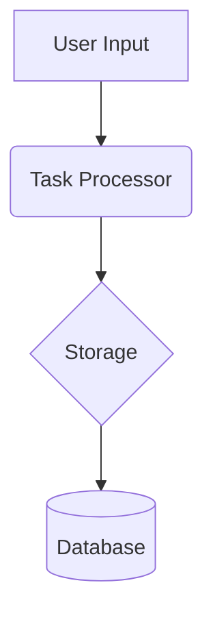
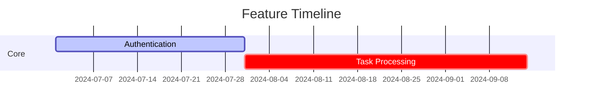
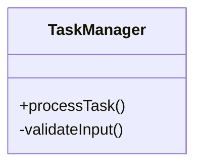

# Documentation Hub

## Structure Overview

```
/docs
├── README.md                  # You are here
├── product/
│   ├── PRD.md                 # Product Requirements
│   ├── ROADMAP.md             # Development Timeline
│   └── releases/
│       ├── RELEASE-p0.md      # Release Notes
│       └── CHANGELOG.md       # Version History
├── technical/
│   ├── ARCHITECTURE.md        # System Design
│   ├── API/                   # Interface Contracts
│   ├── DEVELOPMENT.md         # Engineering Standards
│   └── decisions/
│       └── ADRs/              # Architecture Decisions
└── guides/
    └── onboarding.md          # Setup Guides
```

## Document Templates

### product/PRD.md
````markdown
# [Product Name] Requirements

## Overview
**Problem Statement:**  
[Clear description of user pain point]

**Success Metrics:**
- [Metric 1] improvement by X%
- [Metric 2] reduction by Y%

## User Stories
| Priority | As a... | I want to... | So that... | Status |
|----------|---------|--------------|------------|--------|
| P0       | User    | Prioritize tasks | Focus on important work | ✅ Done |

## System Architecture


## API Compatibility
| Version | Changes | Supported Until |
|---------|---------|-----------------|
| v1.2    | Added filtering | 2025-Q1 |
````

### product/ROADMAP.md
````markdown
# Product Roadmap

## Current Quarter (2024-Q3)



## OKRs
| Objective | Key Result | Owner | Progress |
|-----------|------------|-------|----------|
| Improve Performance | Reduce latency <200ms | Backend | 75% ✅ |
````

### product/releases/CHANGELOG.md
````markdown
# Version History

## v1.2.0 - 2024-06-20
### Added
- Task filtering capability
- Performance metrics dashboard

### Changed
- **Breaking:** Updated auth token format

## v1.1.0 - 2024-05-15
- Initial public release
````

### technical/ARCHITECTURE.md
````markdown
# System Architecture

## Component Diagram



## Data Flow
1. User submits task
2. Validation layer checks format
3. Processor prioritizes using ML model
4. Stored in PostgreSQL DB
````

### technical/API/SPECIFICATION.md
````markdown
# API Documentation

## Endpoints

```http
POST /api/v1/tasks
Content-Type: application/json

{
  "title": "Review docs",
  "priority": 2
}
```

## Error Codes
| Code | Meaning | Resolution |
|------|---------|------------|
| 429   | Rate limited | Retry after 60s |
````

### technical/DEVELOPMENT.md
````markdown
# Development Standards

## Testing Requirements
```yaml
jest:
  coverage:
    statements: 80%
    branches: 75%
    functions: 85%
```

## Branch Naming
```
feat/123-add-filtering
fix/456-auth-bug
```
````

### technical/decisions/ADRs/001-clean-architecture.md
````markdown
# ADR 001: Clean Architecture Implementation

## Context
Needed to isolate business logic from framework dependencies

## Options Considered
1. Monolithic MVC ❌ Hard to test
2. Clean Architecture ✅ Enables substitution of components

## Consequences
- + Independent component testing
- - Initial setup complexity
````

### guides/onboarding.md
````markdown
# Onboarding Guide

## Developer Setup
1. Install [JDK 21](https://adoptium.net)
2. Clone repo: `git clone [repo-url]`
3. Run `npm ci`

## Access Requests
```table
| Resource       | Form Link          | Approver       |
|----------------|--------------------|----------------|
| Prod Database  | [Internal Link]    | DevOps Lead    |
```
````

## Navigation
| Role          | Start With                 |
|---------------|----------------------------|
| New Developer | guides/onboarding.md       |
| PM            | product/PRD.md             |
| Architect     | technical/ARCHITECTURE.md  |
```

This README:
- Uses GitHub/Mermaid-compatible markdown
- Contains directly renderable templates
- Maintains hierarchical structure
- Includes both technical and product docs
- Provides role-based entry points

To use:
1. Copy this entire file to `/docs/README.md`
2. Create directories as shown
3. Populate each template with your content
4. Commit with message: "docs: Initialize documentation structure"