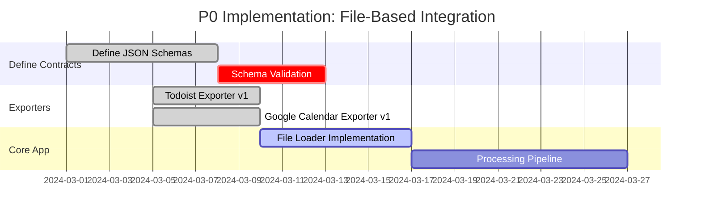

# Task Priority Lite: Migration Playbook for Refactoring & Integration

This document serves as a comprehensive guide for the migration and refactoring of Task Priority Lite. It covers:

- The overall project refactoring goals and clean architecture principles
- A phased roadmap from a file-based integration (P0) to an automated, real-time, multi-user, service-oriented system (P1 & P2)
- Language and technology decisions at each phase
- Detailed integration strategies, including necessary tooling, folder organization, API design, and additional operational considerations

---

## 1. Overall Project Refactoring

### **Clean Architecture Foundation**

The project is already structured into the following layers:

- **Core Layer:**  
  Contains domain models (e.g., _Task_, _Project_), core interfaces (e.g., for input, processing, storage), and business logic (like GTD clarification and prioritization). This layer must remain isolated from infrastructure details.

- **Application Layer:**  
  Implements use cases via processors, managers, and orchestration services. This is where the business rules are applied.

- **Infrastructure Layer:**  
  Contains concrete implementations for storage (currently a file-based _FileStorageService_), external adapters (for integrating with Todoist, Google Calendar, etc.), and other technical concerns.

- **Presentation Layer:**  
  Initially a Command-Line Interface (CLI), with plans to add a REST API and later a web dashboard.

**Key Principle:**  
_All layers should interact only through well-defined interfaces._ This guarantees that if data sources or communication methods change later (e.g., swapping file I/O for API calls), the core business logic remains unaffected.

---

## 2. Phase 0 (P0): File-Based Integration (Deepseek’s Approach)

### **Objective: Rapid MVP Delivery with Minimal Complexity**

#### **A. Exporter Bounded Contexts (Python Modules)**

- **Todoist Exporter:**
  - Retrieves data from the Todoist API using Python SDKs.
  - Converts data into a standardized JSON format (e.g. `todoist_export.json`), adhering to a strict JSON schema.
- **Google Calendar Exporter:**
  - Connects to Google Calendar and/or Google Tasks via OAuth.
  - Outputs JSON files (e.g. `calendar_events.json` and `calendar_tasks.json`).

Each exporter acts as an independent bounded context using its own “ubiquitous language” (i.e., Todoist or Google-specific terms).

#### **B. JSON Schema as the Integration Contract**

- **Define and Document Schemas:**  
  Create JSON Schema files (e.g. `todoist_schema.json`, `calendar_schema.json`) that clearly specify the structure, data types, and required fields for each exporter’s output.
- **Benefits:**
  - Enforces a strict contract between exporters and the TypeScript core.
  - Allows independent evolution of exporters as long as the schema is maintained.
  - Provides a foundation for automated validation in both Python and TypeScript.

_Example Schema Snippet:_

```json
{
  "$schema": "http://json-schema.org/draft-07/schema#",
  "type": "object",
  "properties": {
    "tasks": {
      "type": "array",
      "items": {
        "type": "object",
        "properties": {
          "id": { "type": "string" },
          "content": { "type": "string" },
          "priority": { "type": "number" },
          "due": { "type": "string", "format": "date-time" }
        },
        "required": ["id", "content"]
      }
    }
  }
}
```

#### **C. TypeScript Core Application**

- **File Storage Adapter:**  
  Develop a module (e.g., in `src/infrastructure/file_storage/`) that reads the JSON files. This module will parse the JSON, validate it against the schema if needed, and convert it into the core domain models.
- **Core Processing:**  
  Once the data is loaded, the core applies its business logic (e.g., GTD clarification, prioritization algorithms) and produces output (e.g., prioritized task lists).

#### **D. Directory Structure**

The following structure (inspired by Deepseek and Gemini) organizes the code to clearly separate exporter contexts from core logic:

```
albeorla-task-pri-lite/
├── exporters/
│   ├── todoist/
│   │   ├── adapter.py
│   │   ├── todoist_schema.json
│   │   └── converter.py
│   ├── google-calendar/
│   │   ├── adapter.py
│   │   ├── calendar_schema.json
│   │   └── converter.py
│   └── shared/
│       └── file_writer.py
└── src/
    └── infrastructure/
         ├── file_storage/
         │   ├── todoist_loader.ts
         │   └── calendar_loader.ts
         └── api/          # Placeholder for future REST endpoints
```

#### **E. P0 Roadmap**

A sample roadmap (inspired by Gemini’s timeline) might look like this:



#### **F. Advantages of P0 Approach**

- **Rapid Development:** Minimal overhead—no need for network services or databases.
- **Decoupled Integration:** Clear contract through JSON schemas ensures that changes in one component do not break the other.
- **Foundation for Future Expansion:** The file storage adapter abstracts data access so it can later be replaced by API clients or database readers without altering core logic.

---

## 3. Phase 1 (P1): Automation & Consolidation

### **Objective: Eliminate Manual Steps and Introduce Persistence**

#### **A. Automation**

- **Scheduler Integration:**  
  Introduce a scheduling mechanism in the TypeScript core (or as a separate orchestrator) that periodically triggers the Python exporters. This could involve:
  - Invoking the exporters as child processes using Node’s `child_process` module.
  - Wrapping exporters in lightweight REST endpoints and calling them automatically.

#### **B. Data Persistence**

- **Intermediary Database (SQLite):**  
  Instead of (or in addition to) reading from files, use SQLite as a lightweight, embedded database to persist the fetched data.
  - **Benefits:** Better data freshness and persistence; allows the system to “remember” previous runs.
  - **Implementation:**
    - Python exporters write their outputs into designated tables in SQLite.
    - The TypeScript core reads from these tables using a Node SQLite client.

#### **C. Potential Language Consolidation**

- **Unified Codebase Possibility:**  
  Evaluate whether migrating the exporters from Python to TypeScript is beneficial for reducing operational overhead. This would simplify the stack and ease the integration, but only if the Python libraries’ advantages (ease of integration with external APIs) are not critical.

#### **D. Infrastructure Interface**

- Maintain the abstraction for data access so that the core logic remains agnostic. The new adapter could check a configuration setting to decide whether to load from JSON files or to query SQLite.

#### **E. P1 Roadmap Summary**

- Automate exporter invocation.
- Integrate SQLite for data persistence.
- Update the file storage adapter to support database reads.
- Maintain the clean interface so that a future transition to an API-based approach is seamless.

---

## 4. Phase 2 (P2): Transition to a Service-Based Architecture

### **Objective: Evolve into a Scalable, Multi-User, Real-Time System**

#### **A. RESTful API Transition**

- **Exporter Services as APIs:**  
  Convert Python exporters into long-running services using a web framework like **FastAPI**. Each exporter will expose endpoints such as:

  - `/todoist/tasks`
  - `/google-calendar/events`

  These endpoints return up-to-date JSON data on demand.

- **TypeScript API Clients:**  
  Replace file reading with HTTP calls. The core can use libraries like `axios` or native fetch APIs to retrieve data.

#### **B. Asynchronous Communication**

- **Message Queue Integration:**  
  Consider implementing a messaging system (e.g., RabbitMQ or Kafka) so that exporters publish new data events. The core subscribes to these events to update its internal state asynchronously. This improves resilience and decoupling.

#### **C. Scalable Data Storage**

- **Database Migration:**  
  Move from SQLite to a more robust solution such as **PostgreSQL** or a NoSQL database, depending on your needs.
  - **Database-per-Service Pattern:** In a microservices architecture, each service can own its data store. Alternatively, a single, well-organized shared database can be used with clear schema boundaries.

#### **D. API Gateway / GraphQL**

- **Unified Data Access:**  
  Introduce an API gateway or GraphQL layer to provide a single interface for clients (e.g., a web dashboard). This gateway can aggregate data from multiple backend services, reducing the need for the client to perform multiple requests.

#### **E. Polyglot Approach for Performance**

- **Language Flexibility:**  
  While the core remains in TypeScript, evaluate performance-critical services.
  - Consider using **Go** for exporter services or background workers if you need better concurrency and performance.
  - Alternatively, **Rust** can be used for highly performance-sensitive tasks like real-time NLP or complex prioritization algorithms.

#### **F. P2 Roadmap Summary**

- Transition exporters to RESTful API services.
- Introduce asynchronous messaging for near real-time data.
- Migrate to a scalable, robust database (PostgreSQL or similar).
- Implement an API gateway or GraphQL layer for unified client access.
- Optionally adopt a polyglot strategy for high-demand components.

---

## 5. Consolidated Roadmap Summary

| Phase  | Integration Method                                                         | Languages                                                                                                                 | Main Objectives                                                                                                        |
| ------ | -------------------------------------------------------------------------- | ------------------------------------------------------------------------------------------------------------------------- | ---------------------------------------------------------------------------------------------------------------------- |
| **P0** | File-based JSON integration                                                | TypeScript (core), Python (exporters)                                                                                     | Rapid MVP rollout; strict JSON contracts; decoupled integration via file system.                                       |
| **P1** | Automated integration using local scheduler & SQLite/REST                  | TypeScript (core); optionally migrate exporters to TS or keep Python                                                      | Eliminate manual steps; introduce data persistence; prepare interfaces for future API calls.                           |
| **P2** | Service-based architecture with REST APIs, message queues, and scalable DB | TypeScript for core & API gateway; consider Go or Rust for performance-critical services; exporters in Python or migrated | Achieve multi-user, real-time functionality; decouple components via service boundaries; scale services independently. |

---

## 6. Critical Implementation Details for a Successful Migration

### **A. JSON Schema Definition and Validation**

- **Define Schemas:**  
  Use JSON Schema (draft-07 or later) to define the data structures for tasks and events. Store these schemas in the exporters’ directories (e.g., `todoist_schema.json`).
- **Validation:**  
  Implement schema validation both in the Python exporters (to ensure correct data output) and in the TypeScript file storage adapter (to verify incoming data). This ensures that any change in external data formats is caught early.

### **B. Abstraction of Data Access in the Infrastructure Layer**

- **Interface Definition:**  
  Define a clear interface (e.g., `IDataSource`) in the core that abstracts data retrieval. The current file-based adapter implements this interface.
- **Future-Proofing:**  
  This abstraction allows you to later swap out the file-based adapter for a REST API client or database repository without modifying core business logic.

### **C. Automation of Data Flow**

- **Scheduler Implementation:**  
  In P1, introduce a scheduler (e.g., using Node’s `setInterval` or a dedicated library like `node-cron`) to automatically invoke data refresh. This minimizes manual intervention and ensures that the system works with current data.
- **Error Handling:**  
  Robust error handling must be implemented. For example, if the Python exporter fails, the system should log the error and retry, rather than crashing the entire application.

### **D. Transition to REST APIs**

- **Service Framework Selection:**  
  For the Python exporters, consider using **FastAPI** for its speed, built-in schema validation (via Pydantic), and auto-generated documentation.
- **API Contract:**  
  Design endpoints carefully—define methods, URL paths, and request/response payloads. Version your API to handle future changes without breaking clients.
- **HTTP Client in TypeScript:**  
  Use libraries like `axios` or `node-fetch` in the TS core to make HTTP requests to the exporter APIs.

### **E. Data Persistence**

- **Database Integration:**  
  Plan to introduce a lightweight database (SQLite for P1) and later migrate to PostgreSQL or MongoDB. This involves:
  - Defining a shared database schema for tasks and events.
  - Implementing repository classes in the infrastructure layer that abstract data read/write operations.
  - Ensuring that these classes adhere to the interfaces defined in the core.

### **F. Service Orchestration and Asynchronous Messaging (P2)**

- **Message Queue Consideration:**  
  Investigate tools like RabbitMQ or Kafka for asynchronous communication between services. This helps decouple the data ingestion process (exporters) from the core processing.
- **API Gateway / GraphQL:**  
  Design an API gateway that aggregates data from multiple services and presents a unified interface to client applications. This might also include a GraphQL layer to allow flexible queries.

### **G. Monitoring, Logging, and CI/CD**

- **Monitoring and Logging:**  
  As you introduce multiple services (in P2), ensure that each service has robust logging and monitoring. Use tools like Prometheus, Grafana, or ELK Stack for centralized monitoring.
- **Continuous Integration / Continuous Deployment (CI/CD):**  
  Set up pipelines to automatically test each component (unit, integration, and end-to-end tests). Containerization (using Docker) can help manage different services and languages in a unified deployment strategy.

---

## 7. Conclusion

This extensive migration playbook for Task Priority Lite consolidates approaches from Deepseek, Gemini, and earlier analysis, ensuring the entire project—not just the exporters—is addressed. Key points include:

- **Phase 0 (P0):**  
  Leverage file-based integration with well-defined JSON schemas to quickly deliver an MVP. The Python exporters (Todoist and Google Calendar) remain unchanged, and the TypeScript core reads the exported JSON data using a file storage adapter.

- **Phase 1 (P1):**  
  Automate the data flow by adding scheduling and a lightweight database (SQLite). Consider unifying languages if beneficial, while ensuring the core’s data access remains abstracted. This phase minimizes manual steps and sets the stage for more real-time operations.

- **Phase 2 (P2):**  
  Transition to a fully service-based architecture with RESTful APIs (or GraphQL) and asynchronous messaging. Each component can then be deployed as an independent service with its own scalable data store, allowing real-time updates, multi-user support, and independent scaling. A polyglot approach becomes an option here if performance-critical services benefit from languages like Go or Rust.

Critical implementation details include:

- Strict JSON schema definition and validation.
- Abstraction of data access in the infrastructure layer.
- Robust scheduling and error handling.
- A clear API contract for eventual RESTful integration.
- A smooth path for database migration and service orchestration.
- Monitoring, logging, and automated testing to support a multi-service environment.

By following this playbook, Task Priority Lite will start with a simple, proven approach (file-based integration) that lays a solid foundation for later automation and scalability. This ensures you deliver immediate value while preparing the system for future evolution.

Would you like further details on any particular component, sample code for any module, or additional guidance on the CI/CD setup?
