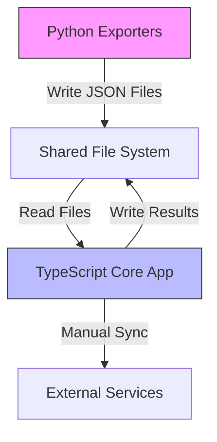
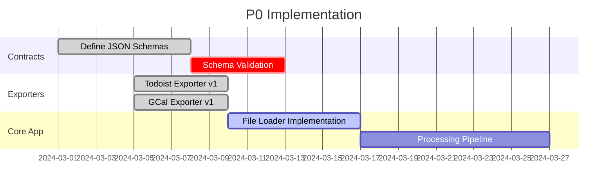
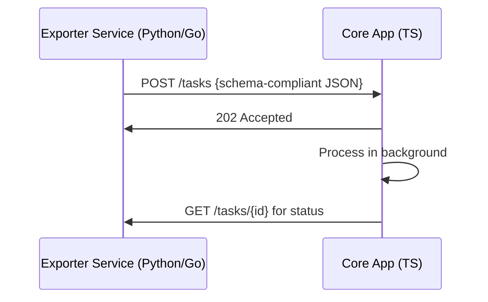

Based on your architecture goals and current state, here's my recommended path forward:

**1. Component Communication Strategy (P0 Release)**



**Key Decisions:**

- **Maintain file-based integration for P0** - This allows shipping MVP quickly while maintaining clear bounded contexts
- **Formalize JSON schemas as integration contracts** - Create strict schema definitions for all input/output files
- **Treat files as temporary event stream** - Structure JSONs as timestamped events for future DB migration

**2. Language Allocation**

- **Python**: Keep for exporters (already implemented, good API ecosystem)
- **TypeScript**: Core app processing (type safety, existing implementation)
- **Future**: Evaluate Go for exporter microservices in v2 when adding real-time needs

**3. Directory Structure Update**

```diff
albeorla-task-pri-lite/
├── exporters/
│   ├── todoist/          # Bounded Context
│   │   ├── adapter.py
│   │   ├── todoist_schema.json
│   │   └── converter.py
│   ├── google-calendar/  # Bounded Context
│   │   ├── adapter.py
│   │   ├── calendar_schema.json
│   │   └── converter.py
│   └── shared/           # Cross-cutting utils
│       └── file_writer.py
└── src/
    └── infrastructure/
        ├── file_storage/ # Anti-corruption layer
        │   ├── todoist_loader.ts
        │   └── calendar_loader.ts
        └── api/          # Future expansion
```

**4. Implementation Roadmap**

**Phase 1 (P0) - File-Based Contracts**



**Phase 2 (v1.1) - Service Foundation**



**5. Critical Schema Example (todoist_export.json)**

```json
// schemas/todoist_task.schema.json
{
  "$schema": "http://json-schema.org/draft-07/schema#",
  "type": "object",
  "properties": {
    "tasks": {
      "type": "array",
      "items": {
        "type": "object",
        "properties": {
          "id": { "type": "string" },
          "content": { "type": "string" },
          "priority": { "type": "number" },
          "due": { "type": "string", "format": "date-time" },
          "context": {
            "type": "object",
            "properties": {
              "project_id": { "type": "string" },
              "section_id": { "type": "string" }
            }
          }
        },
        "required": ["id", "content"]
      }
    }
  }
}
```

**6. Transition Plan to Services**

1. **Immediate (P0):**

   - Maintain Python exporters but containerize them
   - Add schema validation to both Python/TS sides
   - Implement file watcher in TS core

2. **Next Version (v1.1):**

   ```mermaid
   graph LR
       A[Exporter Containers] -->|HTTP| B[Message Broker]
       B -->|Events| C[TS Core App]
       C -->|gRPC| D[Priority Engine]
       D -->|Write| E[(PostgreSQL)]
   ```

   - Add NATS/RabbitMQ for async communication
   - Create Go-based priority engine prototype
   - Start PostgreSQL container for shared storage

3. **Future (v2):**
   - Gradual migration of exporters to Go
   - Rust-based NLP module for auto-classification
   - GraphQL gateway for unified querying

**Recommendation:** Implement the file-based contracts first but structure all code as if the services already exist. This means:

- TypeScript interfaces that mirror future API calls
- Python classes that can be converted to HTTP handlers
- Clear separation between data fetching and processing

Would you like me to elaborate on any of these components or provide implementation details for specific parts?
