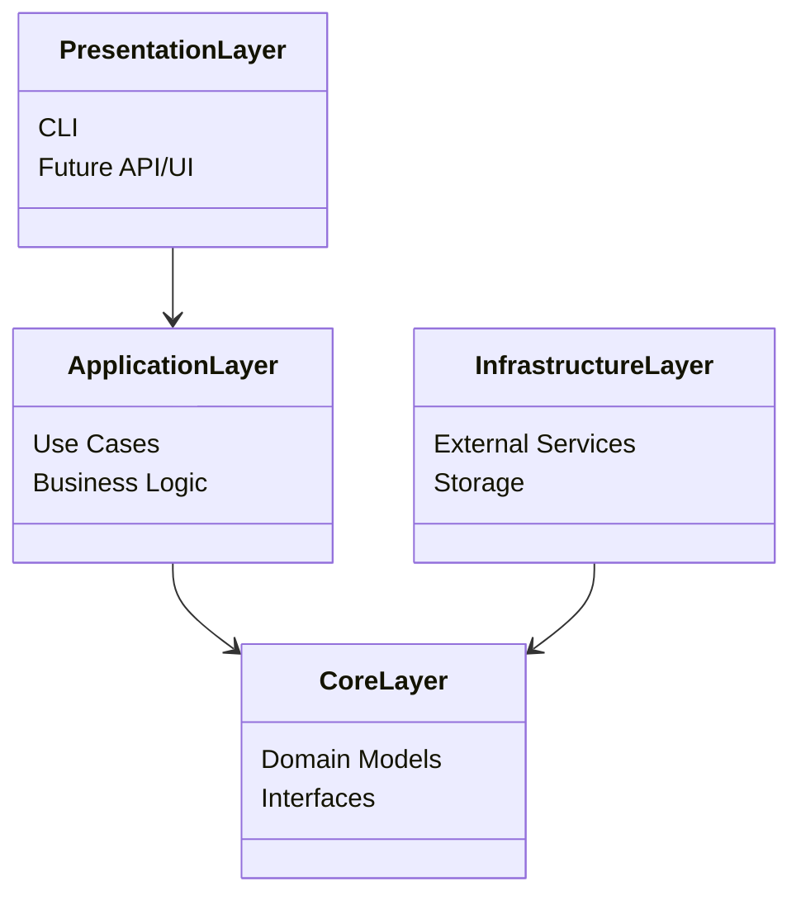
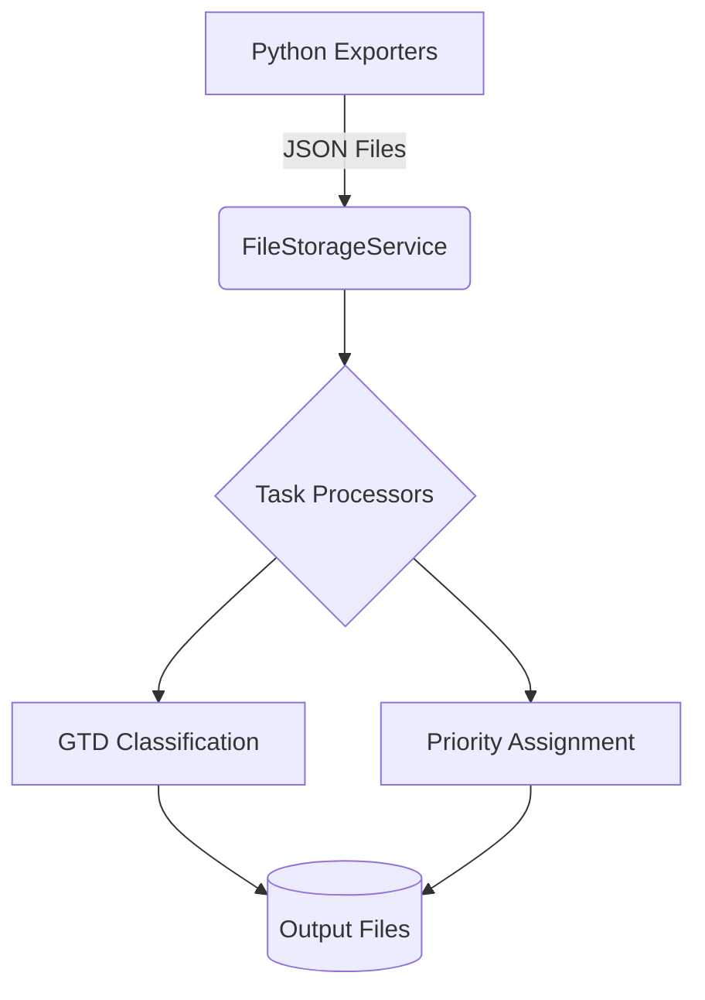

# System Architecture

Task Priority Lite follows the Clean Architecture pattern with distinct layers that separate concerns and enable flexibility in implementation details.

## Clean Architecture Layers

### Core Layer
- Contains domain entities (Task, Project, Event)
- Defines repository and service interfaces
- Independent of external frameworks or implementation details

### Application Layer
- Implements business logic and use cases
- Orchestrates domain objects
- Contains processors (GTD classification, priority calculation)
- Depends only on the Core layer

### Infrastructure Layer
- Implements interfaces defined in Core
- Contains concrete implementations of repositories and services
- Handles external integration (FileStorageService)
- Adapters for external services

### Presentation Layer
- Currently a Command Line Interface (CLI)
- Future: REST API, Web Dashboard
- Depends on Application layer for functionality

## Current Data Flow

1. Python exporters fetch data from external services (Todoist, Google Calendar)
2. Data is saved as JSON files in the output directory
3. TypeScript application loads files via FileStorageService
4. Task processors apply business logic (classification, prioritization)
5. Results are stored back to files

## Future Architecture Evolution

See our [Technical Roadmap](./ROADMAP.md) for details on the planned evolution toward:
- Service-based integration (REST/GraphQL)
- Database storage (SQLite → PostgreSQL/MongoDB)
- Performance optimizations (Go/Rust components) 