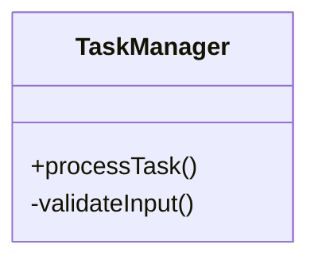

# System Architecture

## Component Diagram

```mermaid
classDiagram
    class TaskManager {
        +processTask()
        -validateInput()
    }
```

## Data Flow
1. User submits task
2. Validation layer checks format
3. Processor prioritizes using ML model
4. Stored in PostgreSQL DB 