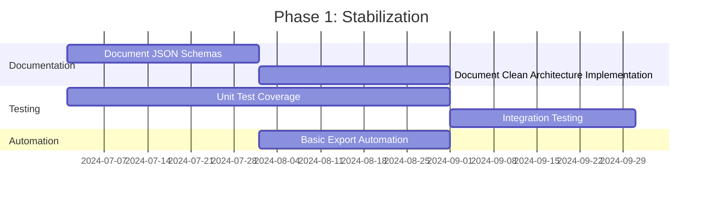
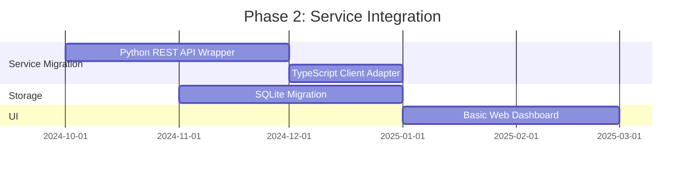
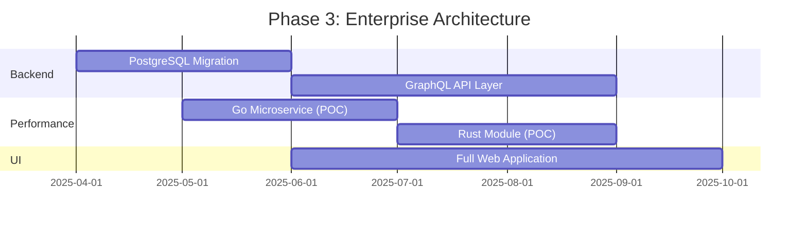

# Technical Roadmap

This roadmap outlines the planned technical evolution of Task Priority Lite, based on the architectural recommendations documented in `ARCHITECTURE-RECOMMENDATIONS.md`.

## Current Architecture (MVP)

- **Language Stack**: TypeScript (core app) + Python (exporters)
- **Integration Method**: File-based JSON exchange
- **Storage**: Local JSON files via FileStorageService
- **UI**: Command Line Interface

## Phase 1: Stabilization & Documentation (Q3 2024)

### Key Deliverables

1. **Document JSON Schemas**
   - Formalize input/output formats for all exporters
   - Add JSON schema validation for both producers and consumers

2. **Clean Architecture Refinement**
   - Ensure strict boundary enforcement between layers
   - Complete adapter implementations for all external dependencies

3. **Testing Strategy**
   - Increase unit test coverage to 80%
   - Add integration tests for Python-TypeScript workflow

4. **Basic Automation**
   - Create simple scheduler/orchestrator to run exporters and app in sequence
   - Add basic error handling and notifications

## Phase 2: Service-Based Integration (Q4 2024 - Q1 2025)

### Key Deliverables

1. **REST API Integration**
   - Wrap Python exporters in lightweight REST API service
   - Update TypeScript app to consume REST endpoints instead of files
   - Implement real-time data fetching vs. batch processing

2. **SQLite Integration**
   - Migrate from file-based storage to SQLite database
   - Implement task/event database schema
   - Optimize queries for common operations

3. **Simple Web UI**
   - Create basic web dashboard for task visualization
   - Implement task management functions in UI

## Phase 3: Enterprise-Ready Architecture (Q2-Q4 2025)

### Key Deliverables

1. **Database Migration**
   - Transition from SQLite to PostgreSQL (or MongoDB)
   - Implement proper indexing, relations, and constraints
   - Add backup and restore procedures

2. **GraphQL API Layer**
   - Replace REST with GraphQL for more flexible data querying
   - Support combined queries across multiple data sources
   - Add real-time subscriptions for data changes

3. **Performance Optimizations**
   - Evaluate and prototype Go microservices for exporters
   - Explore Rust for performance-critical processing components
   - Benchmark and compare performance improvements

4. **Full Web Application**
   - Complete web-based user experience
   - Advanced visualization and reporting
   - Mobile-responsive design

## Decision Framework

When implementing these changes, we'll follow these principles:

1. **Incremental Migration**: Each component should be replaceable independently
2. **Backward Compatibility**: New implementations must work with existing ones during transition
3. **Measurable Improvements**: Each change must demonstrate concrete benefits (speed, reliability, etc.)
4. **User Impact**: Prioritize changes that directly improve user experience

This roadmap aligns with the architectural vision in `ARCHITECTURE-RECOMMENDATIONS.md` while providing a practical, phased approach to implementation. 